# MADAssistant Client SDK
Mobile Android Debugging Assistant.
This is the SDK for integration in client applications.

## Table of Contents
1. [What is MADAssistant](#what-is-madassistant)
2. [Repository App](#repository-app)
3. [Features](#features)
4. [Who is it for?](#who-is-it-for)
5. [Security](#security)
6. [Usage](#usage)
7. [Sample App](#sample-app)

## What is MADAssistant?
- An on-device solution for logging a variety of information from client apps.
- Aids in the debugging and auditing of client apps, by providing a repository and viewer for logs generated by the apps, on the device itself.
- Achieves this by pairing with the MADAssistant app, which serves as the repository, and viewer, for the logs.
- By providing a means to store and view these logs, it aims to provide diagnostic information to debug any issues that arise in a client app.

### Repository App
- This serves as repository and viewer for all the logs generated by the library.
- Provides a session-wise display of the logs
- All logs are stored only on the device and not sent anywhere
- Provides the option to mail a single log or an entire session via share
- Available at https://play.google.com/store/apps/details?id=com.evdayapps.madassistant.repository
#### Screenshots
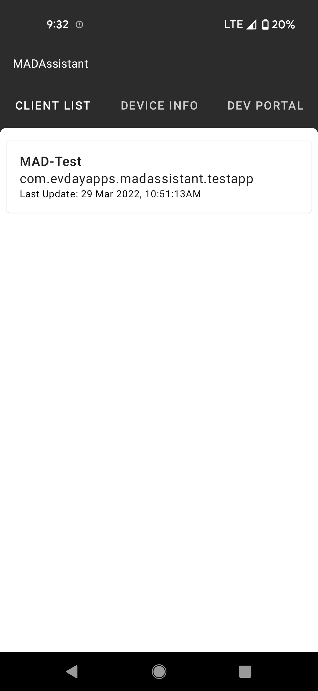
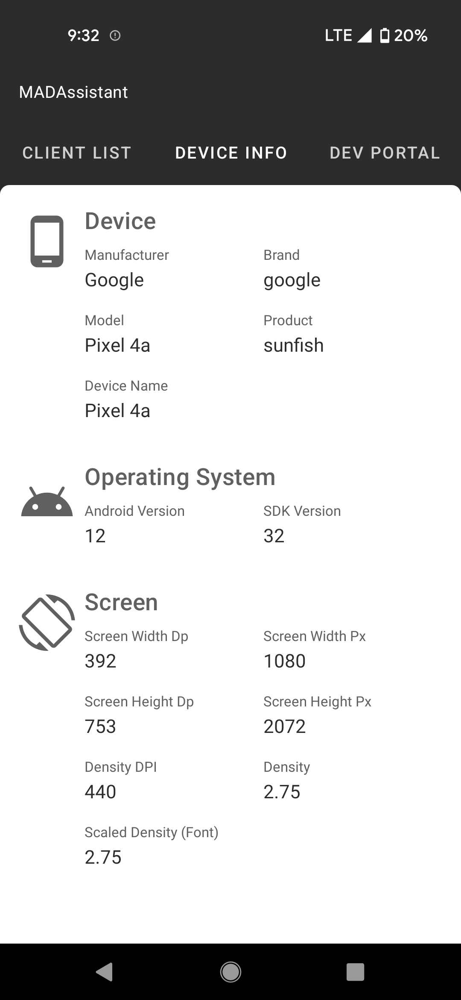
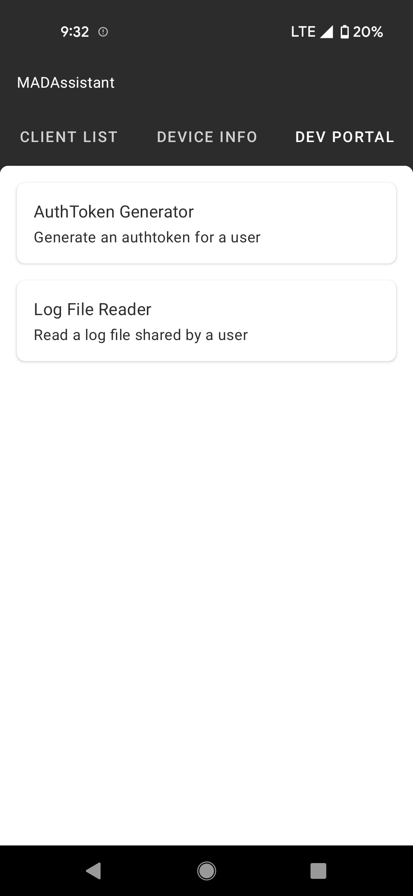
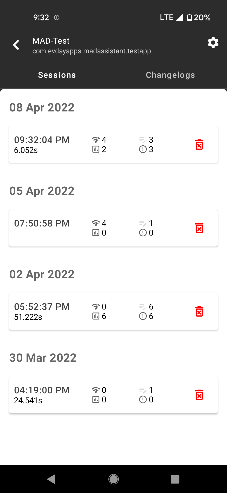
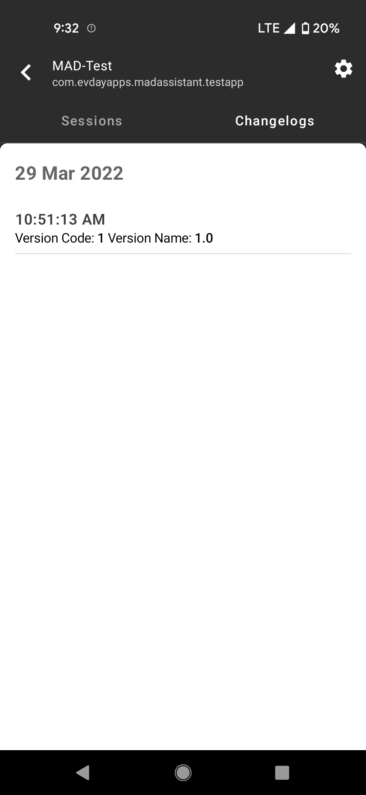
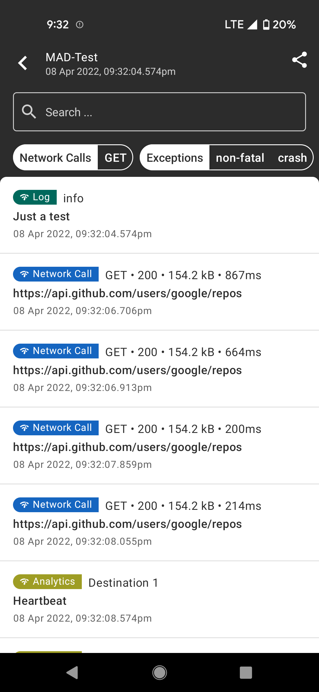
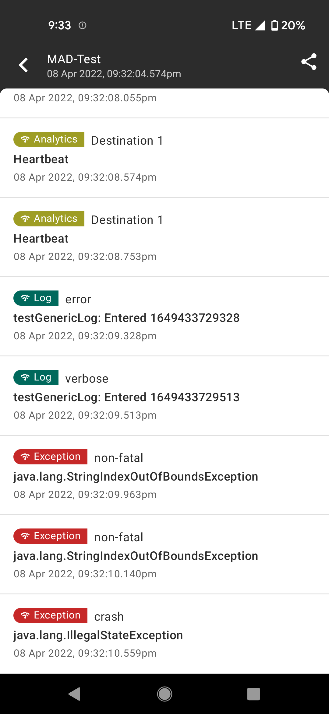
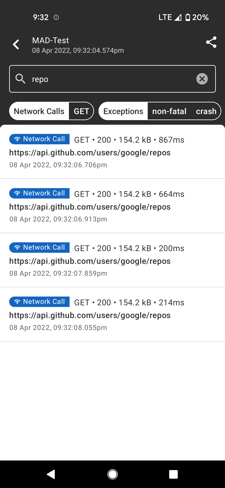
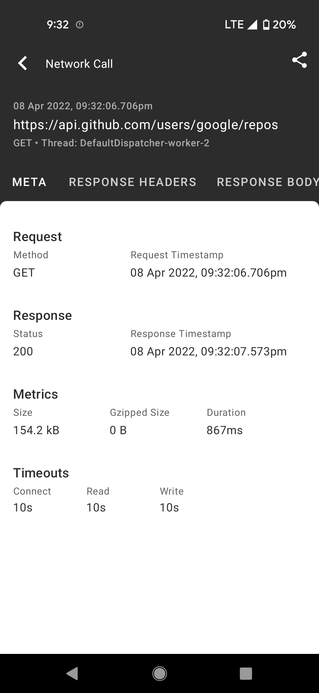
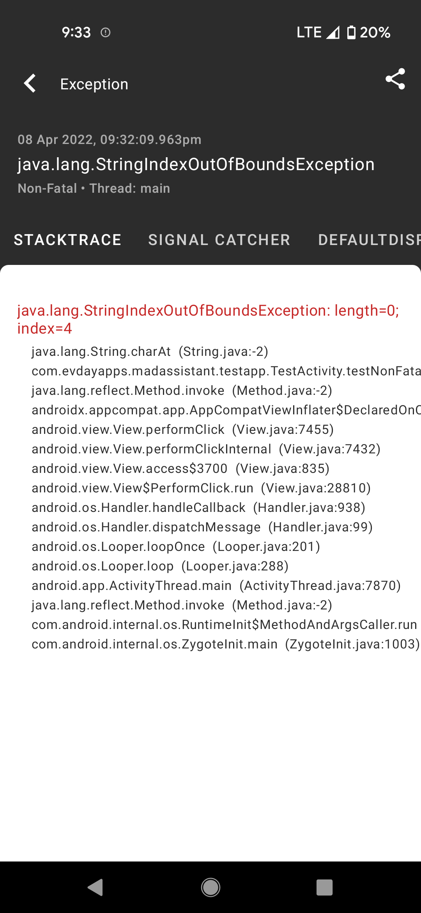
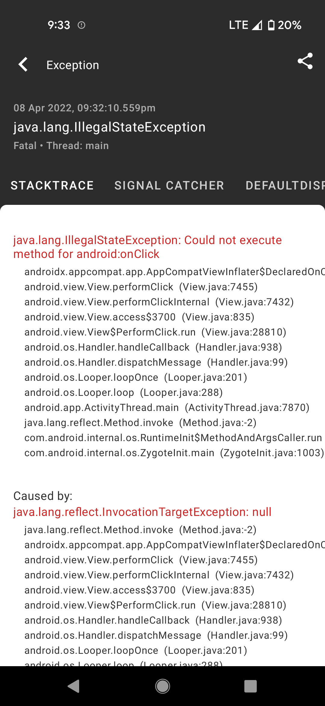
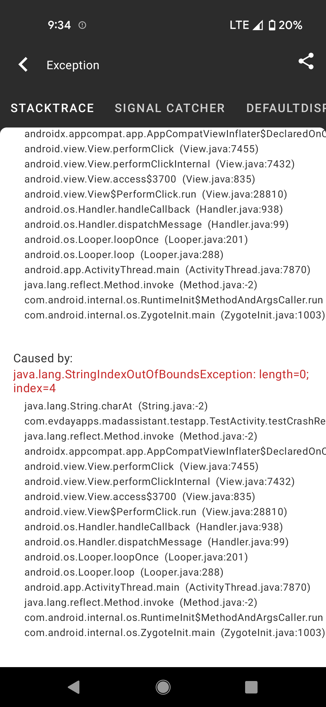
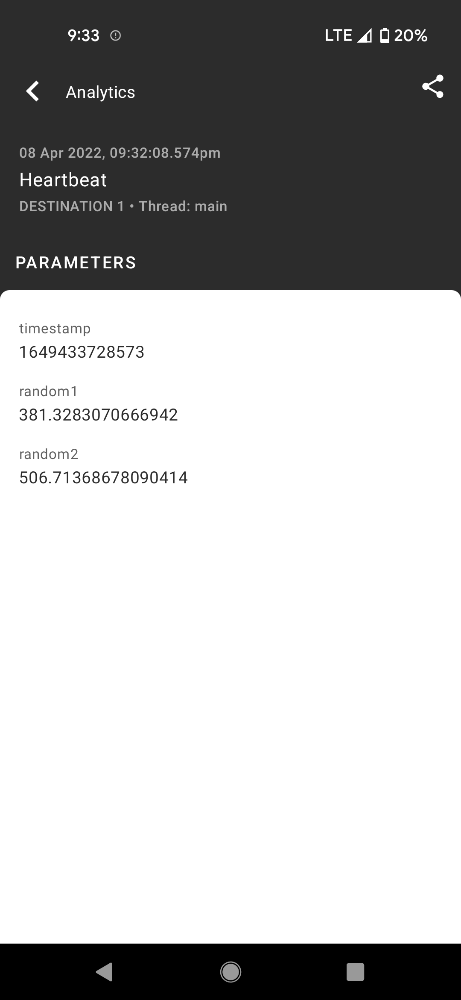
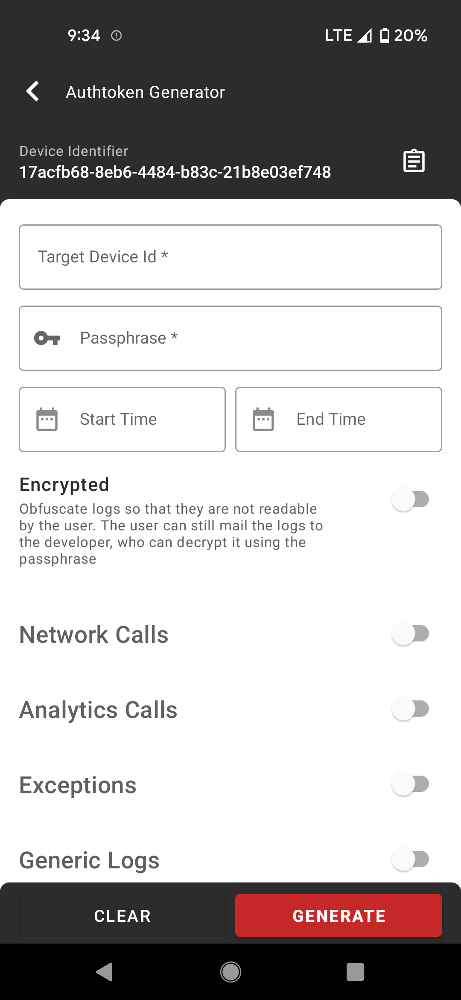
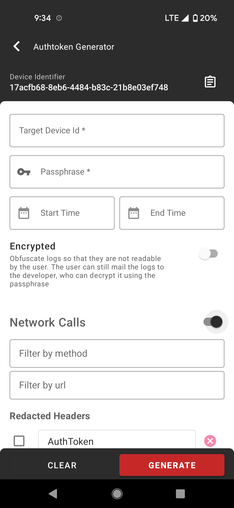


## Features
The library currently provides logging for the following types of events:
- Network Logs
- Analytics Calls
- Exceptions and Crashes
- Generics Logs

## Who is it for?
##### Product Owners
- Logging of analytics events and network calls aid in audit and debugging of issues
##### Testers
- Logging of network calls, analytics events, exceptions and crashes while testing aids in raising more detailed bug reports
##### Developers
- Enable developers to retrieve logs for a particular issue without having to replicate the issue on their end, which might be impossible in some cases.
##### End Users
- This library may even be integrated into production builds, to enable debugging of hard-to-reproduce issues happening on a client's device.


## Security
An auth-token based system that controls what logs the user may view based on:
- The user's installation identifier (a uuid generated by the MADAssistant app once per installation)
- An optional start and end time
- The logs accessible to the user (with fine-grained regex-based filters). This information is encrypted using a passphrase which needs to provided to this library on runtime, to decrypt. 
- All filtering is performed within the client library and then sent to the MADAssistant app


NOTE: These logs are not uploaded to any server and will remain only on the user's device.


## Usage
- Add the jitpack repository to project build.gradle
  ```
  allprojects {
	repositories {
		...
		maven { url 'https://jitpack.io' }
	}
  }
  ```
- Add the library as a dependency
  ```
  implementation 'com.github.Evdayapps:madassistant-clientsdk:<latest-version>'
  ```
- Create an instance of MADAssistantClient
  ```
  val logUtils = object : Logger {
            override fun i(tag: String, message: String) {
                Log.i(tag, message)
            }

            override fun v(tag: String, message: String) {
                Log.v(tag, message)
            }

            override fun d(tag: String, message: String) {
                Log.d(tag, message)
            }

            override fun e(throwable: Throwable) {
                throwable.printStackTrace()
            }
        }

        madAssistantClient = MADAssistantClientImpl(
            applicationContext = applicationContext,
            passphrase = "<enter your passphrase here>",
            logger = logUtils,
            callback = object : MADAssistantClient.Callback {
                override fun onSessionStarted(sessionId: Long) {
                    Log.i("MADAssistant","Session Started")
                }

                override fun onSessionEnded(sessionId: Long) {}

                override fun onConnected() {
                    Log.i("MADAssistant","Connected")
                }

                override fun onDisconnected(code: Int, message: String) {}

            }
        )

        // Bind the client to the remote service
        madAssistantClient.connect()

        // Start a session
        madAssistantClient.startSession()

        // Test log
        madAssistantClient.logGenericLog(Log.INFO,"Test","Just a test")
  ```
- Log events using the appropriate method
  ```
  // For Exceptions
  fun logException(throwable: Throwable, message: String?, data: Map<String, Any?>?)
  
  // For Analytics
  fun logAnalyticsEvent(destination: String, eventName: String, data: Map<String, Any?>)
  
  // For logs that match android.util.Log
  fun logGenericLog(type: Int, tag: String, message: String, data: Map<String, Any?>?)

  // For network logs. 
  fun logNetworkCall(data: NetworkCallLogModel)
  Or use MADAssistantOkHttp3Interceptor as an interceptor in OkHttp3 setups
  ```
- Logging Crashes
  ```
  client.logCrashes()
  ```
  Alternately, crashes can be logged manually too using:
  ```
  client.logCrashReport(throwable: Throwable)
  ```
 
## Sample App
A sample client app is available in the testapp folder. The same will soon be available on the play store too


